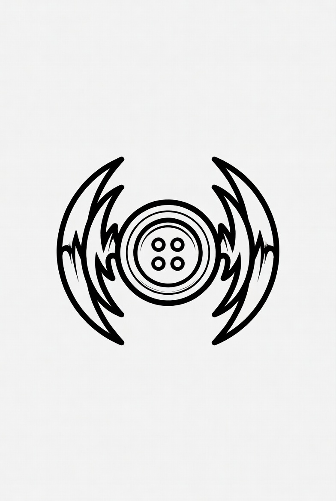

<p align="center">
  
</p>

# KnoflikSDR

SDR přijímač psaný v Rustu pro **SoftRock** (I/Q ze zvukové karty, ladění Si570 přes USB
protokolem DG8SAQ) a **SDRplay RSP1** (přes SoapySDR). K tomu panorama, vodopád
a demodulace AM/USB/LSB.

Vznikl jako náhrada Quisku pro ty SoftRocky, které berou I/Q ze zvukovky — s cílem mít
jeden statický binár místo Pythonu s C rozšířením.

## Co umí

- **Příjem AM, USB, LSB a CW** z I/Q; **WFM** (VKV rozhlas) a **NFM** (2 m/70 cm) na RSP1
- **Ladění Si570** přes USB, bez proprietárních knihoven
- **Panorama a vodopád** přes celou vzorkovací frekvenci, s mřížkou v dB a kHz
- **Bandplan i pro VKV/UHF** — s RSP1 se ladí souvisle do 2 GHz; vyznačená amatérská pásma
  6 m / 2 m / 70 cm / 23 cm, FM rozhlas i orientační DAB/DVB-T
- **Velké skoky ladění** — na RSP1 tlačítka ±10 k / ±100 k / ±1 M kHz, na SoftRocku jemná
- **Ladění kliknutím** do spektra i vodopádu, tažením hran se mění šířka pásma
- **Oblíbené stanice** — jedním klikem i s režimem a šířkou filtru
- **Kdo to vlastně vysílá** — v AM se podle rozpisu EiBi ukáže, která stanice
  má na naladěné frekvenci právě teď být
- **Vyznačená mrtvá zóna** kolem VFO, kde má SoftRock DC spur
- **Doladění na nejsilnější stanici** po skoku o celé okno
- **Dvě rádia** — SoftRock i SDRplay RSP1, přepínají se **za běhu** selectem v liště
- **Volitelná vzorkovačka RSP1** — od 1,344 MHz (užší, lehčí) po 6 MHz, vždy s celočíselnou decimací
- **Nastavení v okně** — zvuková zařízení, bitová hloubka, zisk i kalibrace Si570
- Nastavení se ukládá průběžně do `~/.config/knoflik-sdr/config.toml`

## Hardware

**SoftRock RX Ensemble II** se Si570 (USB VID:PID `16c0:05dc`, firmware DG8SAQ)
a zvukovkou Creative Sound Blaster HD na 96 kHz. Formát si program **vyjedná sám** —
zkouší 192/96/48 kHz a v každé rychlosti nejdřív 24 bit, pak 16.

**SDRplay RSP1** (`1df7:2500`) přes SoapySDR, modul `miri`. Jede na 1 344 kHz, což je
48 kHz × 28 — decimace na zvuk tak vychází celým číslem. Podrobnosti a co zbývá ověřit
jsou v [docs/sdrplay-rsp1.md](docs/sdrplay-rsp1.md). Platí **jen pro RSP1**; RSP1A a RSP2
mají hardware navíc, který libmirisdr neřeší.

## Sestavení

Potřebuješ Rust a vývojové balíčky libusb; na Linuxu navíc ALSA a SoapySDR:

```bash
sudo apt install libasound2-dev libusb-1.0-0-dev libsoapysdr-dev soapysdr-module-mirisdr
cargo build --release
./target/release/knoflik-sdr
```

Kdo má jen SoftRock, může si SoapySDR odpustit — pak ale nebude RSP1:

```bash
cargo build --release --no-default-features
```

Diagnostika bez GUI — ukáže, co si vyjednal vstup a jestli teče signál:

```bash
./target/release/knoflik-sdr --probe
```

## Nastavení

Rádio se přepíná **selectem „rádio:" přímo v liště** — SoftRock ↔ RSP1 se přepne hned za běhu,
bez restartu. Tlačítko **⚙ nastavení** otevře okno s parametry: vzorkovačka RSP1, zisk, vstupní
a výstupní zvuková karta, strop bitové hloubky a kalibrace Si570. Nabízí se jen to, co pro
zvolené rádio dává smysl.

Přepnutí rádia, vzorkovačky i zisku se projeví **hned**. Změna vstupní zvukovky, hloubky nebo
Si570 se v okně potvrdí tlačítkem **↻ Použít změny** (taky bez restartu). Jen výstupní zařízení
se mění restartem.

Krystal je potřeba zkalibrovat pro každý kus zvlášť. Hodnotu můžeš převzít z `~/.quisk_conf.py`,
pokud jsi předtím jel na Quisku.

USB práva řeší na Debianu udev pravidlo z `libhamlib4`, root potřeba není.

## Přenositelnost

Zvuk je jediné, co se mezi systémy liší:

| | vstup a výstup | hloubka na `automaticky` |
|---|---|---|
| **Linux** | ALSA napřímo | 24 bit (`S243LE`) |
| **Windows** | cpal → WASAPI | 16 bit |
| **macOS** | cpal → CoreAudio | 16 bit |

Packed 24 bit umí spolehlivě jen ALSA. Jinde o formátu rozhoduje zvukový server, proto
tam automatika cílí na 16 bit — v nastavení jde hloubka přepnout ručně, kdyby to karta
zvládla. Zbytek (DSP, GUI přes OpenGL, ladění Si570 přes libusb) je stejný všude.

Na Windows si libusb ovladač pro SoftRock musíš podstrčit přes [Zadig](https://zadig.akeo.ie/),
jinak se rádio na USB nenajde.

## Rozpis stanic

Sezónní rozpis KV rozhlasu se stahuje z [EiBi](http://www.eibispace.de) do
`~/.cache/knoflik-sdr/`. Stahuje se jednou za sezónu, na pozadí — start
aplikace na síť nečeká a bez připojení funguje všechno ostatní.

Data udržuje a volně poskytuje Eike Bierwirth. Poděkování patří jemu.

## Licence

**GPL-3.0-or-later**, viz [LICENSE](LICENSE).

Funkce `registers()` v `src/si570.rs` je port ze souboru `softrock/hardware_usb.py` projektu
[Quisk](https://james.ahlstrom.name/quisk/) — Copyright (C) 2006-2025 James C. Ahlstrom, GPL.
Vlastní výpočet HSDIV/N1/RFREQ pro Si570 napsal **Ethan Blanton, KB8OJH**. Zbytek programu
je psaný od nuly.

## Stav

Funkční přijímač pro denní poslech. Vysílání není a zatím se nechystá.

Poznámky k dalším směrům:

- [docs/raspberry-pi.md](docs/raspberry-pi.md) — provoz SoftRocku na Pi.
  DSP zabere ~8 % jádra i9, takže by to mělo stačit; úzkým hrdlem bude spíš
  vodopád než procesor.
- [docs/sdrplay-rsp1.md](docs/sdrplay-rsp1.md) — SDRplay RSP1: řetězec jede
  a panorama ukazuje signál, ale **jestli to pořádně zní, zatím nikdo
  neposoudil**. Otevřené je řízení zisku (přes SoapyMiri jen LNA 0–10,2 dB)
  a IF filtry tuneru.
