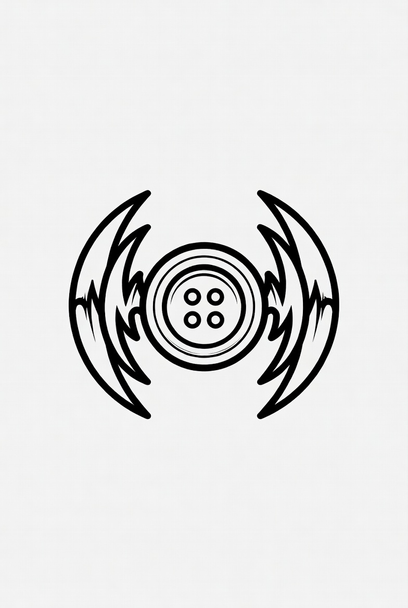

<p align="center">
  
</p>

# KnoflikSDR

SDR přijímač psaný v Rustu pro **SoftRock** (I/Q ze zvukové karty, ladění Si570 přes USB
protokolem DG8SAQ) a **SDRplay RSP1** (přes SoapySDR). K tomu panorama, vodopád
a demodulace AM/USB/LSB/CW, na RSP1 i WFM se stereem a RDS a NFM na 2 m/70 cm.

Vznikl jako náhrada Quisku pro ty SoftRocky, které berou I/Q ze zvukovky — s cílem mít
jeden statický binár místo Pythonu s C rozšířením.

## Co umí

- **Příjem AM, USB, LSB a CW** z I/Q; **WFM** (VKV rozhlas) a **NFM** (2 m/70 cm) na RSP1
- **Ladění Si570** přes USB, bez proprietárních knihoven
- **Panorama a vodopád** přes celou vzorkovací frekvenci, s mřížkou v dB a kHz
- **Šumová brána (squelch)** pro všechny režimy — umlčí zvuk pod nastaveným prahem, ať mezi
  stanicemi nesyčí; práh je vidět jako vodorovnou čáru v panoramatu
- **Nastavitelná AGC** — rychlá (CW), střední, pomalá (SSB a AM), nebo vypnutá s ručním ziskem
- **Ruční notch** — úzká zádrž na heterodynní pískot, běží před AGC a značí se ve spektru
- **Skenování** — projíždí oblíbené nebo viditelný výřez a zastaví, když signál otevře bránu
- **Nahrávání do WAV** — 48 kHz, 16 bit; ukládá se před hlasitostí, tak ji knoflík neovlivní
- **WFM stereo a plnohodnotné RDS** — z pilotu 19 kHz se fázovým závěsem odvodí podnosná
  38 kHz i nosná RDS na 57 kHz. Dekodér zvládá koherentní demodulaci s dohledáním fáze,
  obnovu bitového taktu a synchronizaci bloků přes syndromy s offsetovými slovy, takže
  ukáže **název stanice, RadioText i PI kód** přímo z éteru. Šířka mezifrekvenční
  propusti (120–230 kHz) jde přiškrtit, když sousední stanice přebíjí
- **Kalibrace stupnice RSP1 bez měřicí techniky** — krystal se u každého kusu liší
  a chyba roste s frekvencí: 12 ppm je na krátkých vlnách pár desítek hertzů, ale na
  70 cm už **5,5 kHz**, tedy skoro půl kanálu. Kalibruje se proti normálu (RWM 9996 kHz,
  WWV/BPM 10 MHz) měřením kmitočtu tónu v CW s přesností kolem 0,1 Hz — a protože se
  počítá proti skutečnému naladění, nemusíš normál trefit na hertz. Jedna hodnota v ppm
  platí pro KV i VKV, protože vzorkovačka i oscilátor jedou z téhož krystalu.
  Orientačně se dá odchylka odečíst i ze stereo pilotu na VKV
- **Bandplan i pro VKV/UHF** — s RSP1 se ladí souvisle do 2 GHz; vyznačená amatérská pásma
  6 m / 2 m / 70 cm / 23 cm, FM rozhlas i orientační DAB/DVB-T
- **Bezlicenční kmitočty** podle všeobecných oprávnění ČTÚ — CB 27 MHz, sdílené kanály
  kolem 77 MHz a 173 MHz, 442 a 448 MHz i PMR446. Slouží k orientaci; pro vysílání
  si vždycky ověř aktuální znění VO-R
- **Velké skoky ladění** — na RSP1 tlačítka ±10 k / ±100 k / ±1 M kHz, na SoftRocku jemná
- **Ladění kliknutím** do spektra i vodopádu, tažením hran se mění šířka pásma
- **Přímé zadání frekvence** — naladěná hodnota se dá rovnou přepsat, takže se na normál
  nebo převáděč trefíš přesně, ne po krocích
- **Zoom se soustředí na naladěnou stanici**, takže se přibližuje to, co posloucháš
- **Ovládání v pojmenovaných skupinách** — ladění, režim, signál, stanice, zvuk,
  zobrazení, rádio a akce. Nic se neschovává, jen se v tom dá orientovat
- **Rozsah panoramatu zvlášť pro každé rádio** — SoftRock jede přes zvukovku, RSP1 má
  vlastní LNA, takže úrovně leží jinde a jedna společná hodnota by se po každém
  přepnutí seřizovala znovu
- **Oblíbené stanice** — jedním klikem i s režimem a šířkou filtru
- **Kdo to vlastně vysílá** — v AM se podle rozpisu EiBi ukáže, která stanice
  má na naladěné frekvenci právě teď být
- **Vyznačená mrtvá zóna** kolem VFO, kde má SoftRock DC spur
- **Doladění na nejsilnější stanici** po skoku o celé okno
- **Dvě rádia** — SoftRock i SDRplay RSP1, přepínají se **za běhu** selectem v liště
- **Volitelná vzorkovačka RSP1** — od 1,344 MHz (užší, lehčí) po 6 MHz, vždy s celočíselnou decimací
- **Nastavení v okně** — zvuková zařízení, bitová hloubka, zisk, kalibrace Si570 i ppm RSP1
- Nastavení se ukládá průběžně do `~/.config/knoflik-sdr/config.toml`

## Hardware

**SoftRock RX Ensemble II** se Si570 (USB VID:PID `16c0:05dc`, firmware DG8SAQ)
a zvukovkou Creative Sound Blaster HD na 96 kHz. Formát si program **vyjedná sám** —
zkouší 192/96/48 kHz a v každé rychlosti nejdřív 24 bit, pak 16.

**SDRplay RSP1** (`1df7:2500`) přes SoapySDR, modul `miri`. Jede na 1 344 kHz, což je
48 kHz × 28 — decimace na zvuk tak vychází celým číslem. Podrobnosti a co zbývá ověřit
jsou v [docs/sdrplay-rsp1.md](docs/sdrplay-rsp1.md). Platí **jen pro RSP1**; RSP1A a RSP2
mají hardware navíc, který libmirisdr neřeší.

## Sestavení

Potřebuješ Rust a vývojové balíčky libusb; na Linuxu navíc ALSA a SoapySDR:

```bash
sudo apt install libasound2-dev libusb-1.0-0-dev libsoapysdr-dev soapysdr-module-mirisdr
cargo build --release
./target/release/knoflik-sdr
```

Kdo má jen SoftRock, může si SoapySDR odpustit — pak ale nebude RSP1:

```bash
cargo build --release --no-default-features
```

Diagnostika bez GUI — ukáže, co si vyjednal vstup a jestli teče signál:

```bash
./target/release/knoflik-sdr --probe
```

## Nastavení

Rádio se přepíná **selectem „rádio:" přímo v liště** — SoftRock ↔ RSP1 se přepne hned za běhu,
bez restartu. Tlačítko **⚙ nastavení** otevře okno s parametry: vzorkovačka RSP1, zisk, vstupní
a výstupní zvuková karta, strop bitové hloubky a kalibrace (Si570 u SoftRocku, ppm u RSP1).
Nabízí se jen to, co pro zvolené rádio dává smysl.

Ovládání na panelu je rozdělené do pojmenovaných skupin — **ladění, režim, signál, stanice**
v prvním řádku, **zvuk, zobrazení, rádio, akce** ve druhém. Nic není schované za rozbalováním;
skupiny se při užším okně jen zalomí.

Přepnutí rádia, vzorkovačky i zisku se projeví **hned**. Změna vstupní zvukovky, hloubky nebo
Si570 se v okně potvrdí tlačítkem **↻ Použít změny** (taky bez restartu). Jen výstupní zařízení
se mění restartem.

Krystal Si570 je potřeba zkalibrovat pro každý kus zvlášť. Hodnotu můžeš převzít
z `~/.quisk_conf.py`, pokud jsi předtím jel na Quisku.

USB práva řeší na Debianu udev pravidlo z `libhamlib4`, root potřeba není.

### Kalibrace RSP1

Krystal RSP1 má taky svou odchylku a stojí za to ji srovnat: chyba je relativní, takže
na 10 MHz jde o desítky hertzů, ale na 70 cm už o kilohertze — dost na to, aby se
nedařilo trefit převáděč.

Vzorkovačka i směšovací oscilátor jedou z **jednoho krystalu**, takže jedna hodnota
v ppm platí pro celý rozsah.

1. Přepni na **CW**, šířku dej ~2 kHz a vypni squelch.
2. Do pole **naladěno** napiš frekvenci normálu, třeba `9996` (RWM, Moskva, rubidium —
   pozná se podle střídání nosné, pulzů a značky `RWM` morseovkou). Dál jsou
   WWV a BPM na 10 MHz. Čím vyšší kmitočet, tím lépe je odchylka vidět.
3. **⚙ nastavení → SDRplay RSP1 → podle normálu (v CW)**: zadej tutéž frekvenci
   a klikni **změřit**. Měř během klidné nosné, ne během pulzů.
4. Zkontroluj výsledek a dej **použít**. Pak změř znovu — má vyjít blízko nule.

Měření bere 0,68 s zvuku a proloží špičku parabolou, takže trefí kmitočet tónu asi na
0,1 Hz; na 10 MHz to odpovídá 0,01 ppm. Počítá se proti **skutečnému naladění**, ne proti
nominálu, takže nemusíš normál trefit na hertz přesně.

Rychlá orientační kontrola je i na VKV: u stereo stanice se v nastavení ukáže odchylka
změřená ze **stereo pilotu 19 kHz**. Norma mu ale povoluje ±2 Hz (±105 ppm), takže se na
jednu stanici nespoléhej — buď to ověř na několika, nebo použij normál na KV.

## Přenositelnost

Zvuk je jediné, co se mezi systémy liší:

| | vstup a výstup | hloubka na `automaticky` |
|---|---|---|
| **Linux** | ALSA napřímo | 24 bit (`S243LE`) |
| **Windows** | cpal → WASAPI | 16 bit |
| **macOS** | cpal → CoreAudio | 16 bit |

Packed 24 bit umí spolehlivě jen ALSA. Jinde o formátu rozhoduje zvukový server, proto
tam automatika cílí na 16 bit — v nastavení jde hloubka přepnout ručně, kdyby to karta
zvládla. Zbytek (DSP, GUI přes OpenGL, ladění Si570 přes libusb) je stejný všude.

Na Windows si libusb ovladač pro SoftRock musíš podstrčit přes [Zadig](https://zadig.akeo.ie/),
jinak se rádio na USB nenajde.

## Rozpis stanic

Sezónní rozpis KV rozhlasu se stahuje z [EiBi](http://www.eibispace.de) do
`~/.cache/knoflik-sdr/`. Stahuje se jednou za sezónu, na pozadí — start
aplikace na síť nečeká a bez připojení funguje všechno ostatní.

Data udržuje a volně poskytuje Eike Bierwirth. Poděkování patří jemu.

## Licence

**GPL-3.0-or-later**, viz [LICENSE](LICENSE).

Funkce `registers()` v `src/si570.rs` je port ze souboru `softrock/hardware_usb.py` projektu
[Quisk](https://james.ahlstrom.name/quisk/) — Copyright (C) 2006-2025 James C. Ahlstrom, GPL.
Vlastní výpočet HSDIV/N1/RFREQ pro Si570 napsal **Ethan Blanton, KB8OJH**. Zbytek programu
je psaný od nuly.

## Stav

Funkční přijímač pro denní poslech. Vysílání není a zatím se nechystá.

Poznámky k dalším směrům:

- [docs/raspberry-pi.md](docs/raspberry-pi.md) — provoz SoftRocku na Pi.
  DSP zabere ~8 % jádra i9, takže by to mělo stačit; úzkým hrdlem bude spíš
  vodopád než procesor.
- [docs/sdrplay-rsp1.md](docs/sdrplay-rsp1.md) — SDRplay RSP1: WFM se stereem
  a RDS je odposlechnuté v éteru, stupnice se dá zkalibrovat proti normálu.
  Otevřené zůstává řízení zisku (přes SoapyMiri jen LNA 0–10,2 dB) a IF filtry
  tuneru.
- **Ztráta vzorků na vysokých vzorkovačkách.** Na 4,8 a 6 MSps hlásí libmirisdr
  „samples lost" — je to strop USB 2.0, ne chyba programu. Pomáhá zapojit RSP1
  do portu, který nevisí za interním hubem. Bulk přenosy (které by se opakovaly
  místo zahazování) SoapyMiri zvolit neumí; šlo by to jen obejitím SoapySDR
  a voláním libmirisdr napřímo.
- **ppm kalibrace se ukládá jen pro RSP1.** SoftRock má vlastní cestu přes
  krystal Si570.
